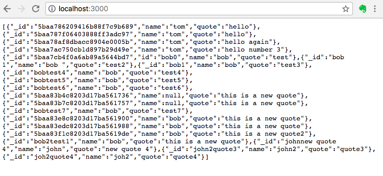
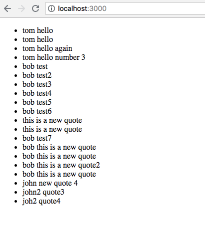
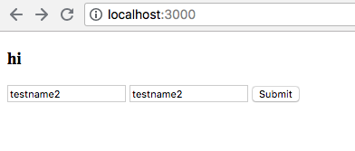
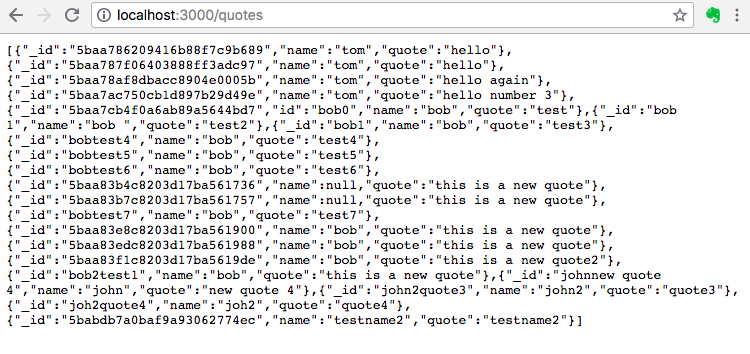
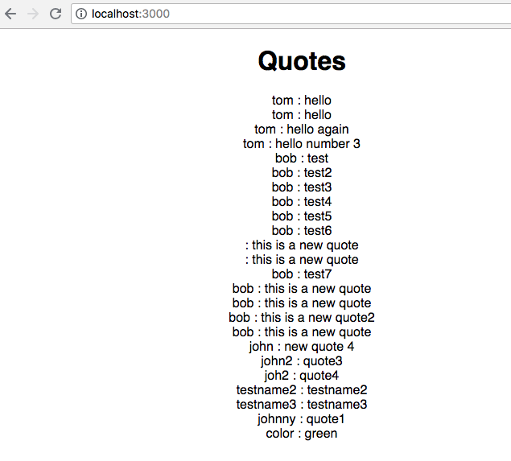
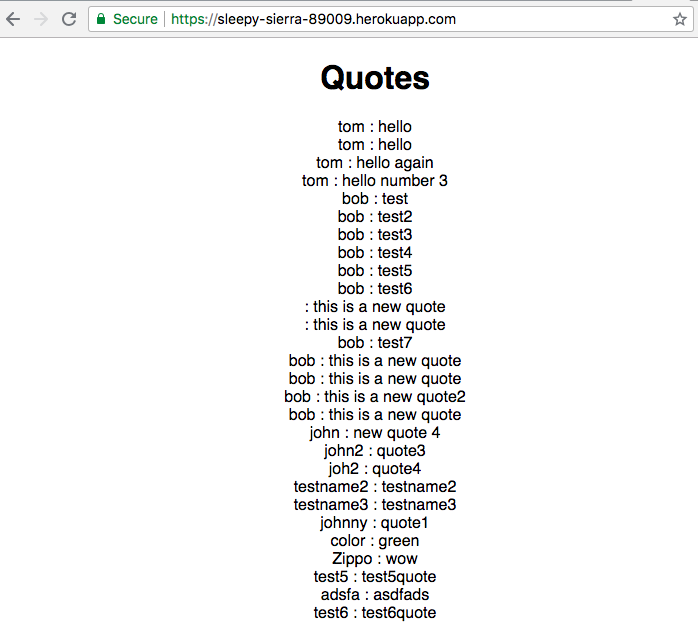
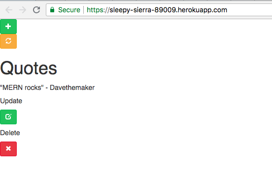

# Todo w/ MERN
## 9/26/2018
### [David Eliason](http://www.davethemaker.com)

## What

This is a single page app that uses a single machine to both serve the React files and also serving API requests. It does this by the use of a proxy script. Express runs on a different port than react. React fetches the data that express serves at the API endpoint, saves it to local component state, and renders.

## How

First, created mongodb connection using local mongodb instance, populating document via mongo. Results served via express as RESTful API.

Then, created mongodb connection using mlab and then rendered the collection's documents via template engine ejs.

Next up was creation of form for document values and calling the POST method via route

which is then served by Express acting as API:

Following was wiring up Create React app with proxy so that the App component fetched the /quotes data from the express route, and rendered in a much nicer, ahem, format within the View.

On the server side, created a route which would have express act as API server, serving all the documents from the db. Another route is a wildcare route, so that all other URLs point to the React homepage. What we have is a [Heroku hosted](https://sleepy-sierra-89009.herokuapp.com/) app with express on the back-end and react on the front-end. 

Moving into the front-end side of things, I used CRA to create the scaffolding so I don't have to get distracted with webpack and such. I created four components: Add, Delete, Quotes, Update to reflect the four methods of CRUD, and initiated them in the parent App component.

This is one of those things that it makes perfect sense once you have it all figured out, but it did take some time to get all the pieces linked up. Actually, connecting with the mongodb instance and invoking methods seems pretty straightforward, but it gets a little tricky grabbing those value data values and such for use within the method. I found this [blog post](https://blog.cloudboost.io/creating-your-first-mern-stack-application-b6604d12e4d3) to be helpful.

