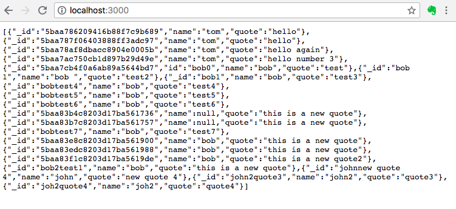

# Todo w/ MERN
## 9/26/2018
### [David Eliason](http://www.davethemaker.com)

## What

First, created mongodb connection using local mongodb instance, populating document via mongo. Results served via express as RESTful API.

Then, created mongodb connection using mlab and then rendered the collection's documents via template engine ejs.

