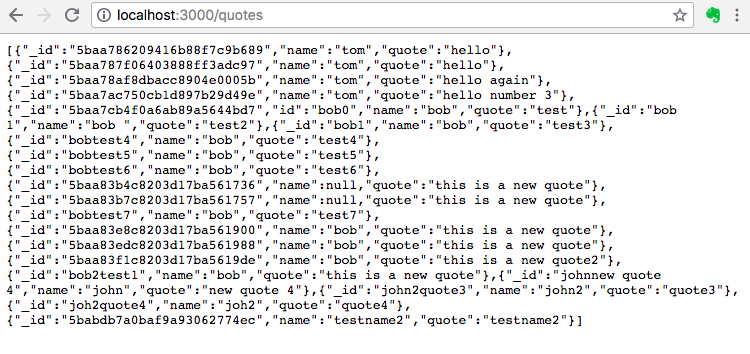
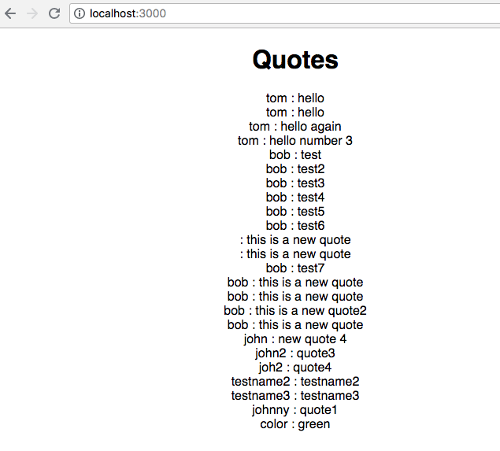
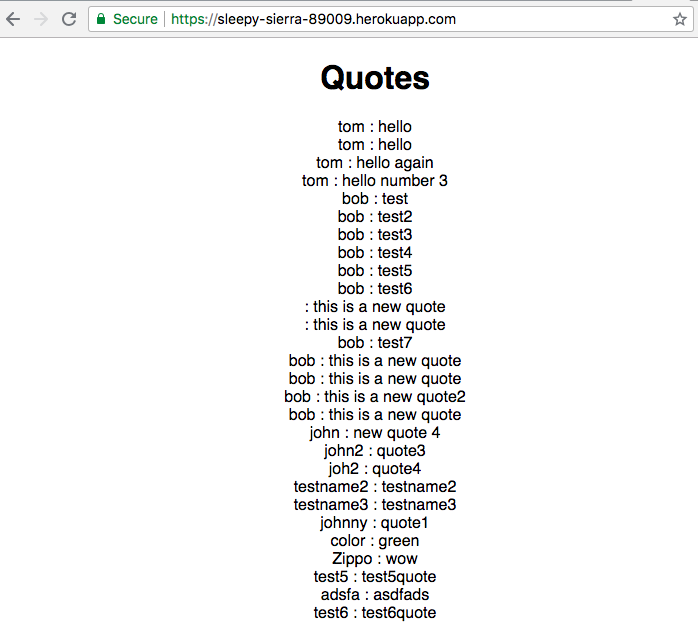

# Todo w/ MERN
## 9/26/2018
### [David Eliason](http://www.davethemaker.com)

## What

First, created mongodb connection using local mongodb instance, populating document via mongo. Results served via express as RESTful API.

Then, created mongodb connection using mlab and then rendered the collection's documents via template engine ejs.

Next up was creation of form for document values and calling the POST method via route

which is then served by Express acting as API:

Following was wiring up Create React app with proxy so that the App component fetched the /quotes data from the express route, and rendered in a much nicer, ahem, format within the View.

On the server side, created a route which would have express act as API server, serving all the documents from the db. Another route is a wildcare route, so that all other URLs point to the React homepage. What we have is a [Heroku hosted](https://sleepy-sierra-89009.herokuapp.com/) app with express on the back-end and react on the front-end. 

